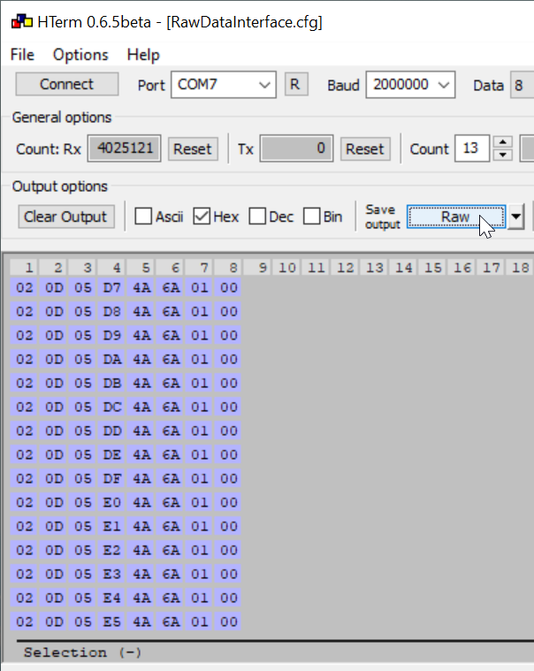
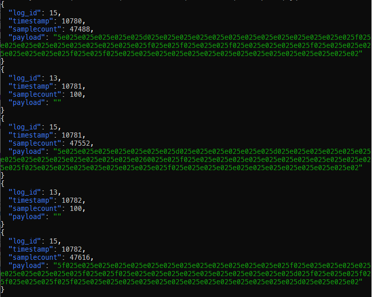

# rawtools

rawtools is a python package that provides tools to work with ZENIT+ and
PRISMA raw data.

Note: It does *not* provide help with controlling a sensing head by means
of the debug interface.


## Command-Line Interface ```rt```

rawtools not only provides a python package, it also provides a command-line
tool named ```rt```. Let's dive into it.

You've stored data retrieved via Loepfe's rawdata interface somehow, e.g.
by saving it from your HTerm:



It really does not matter with what tool you save the data, just make sure
you store the _unchanged_ data as received from the serial port.

Let's say you've saved it at `mydata.raw`. This data is COBS encoded
("consistent overhead byte stuffing"), i.e., encoded in such a way that the
data does not contain null bytes anymore. This enabled us to use the the
null byte as EOF character ("end of message").

Let's remove the COBS encoding:

```
> cat mydata.raw | rt decobs
...
0f001c2a80b95e025e025e025e025e025d025e025e025e025e025e025e025e025e025e025e025e025e025f025e025e025e025e025e025e025e025e025e025f025e025f025e025e025f025e025e025e025e025f025e025e025e025e025e025e025e025f025e025f025e025e025e025e025e025e025e025e025e025e025e025e025e025e025e02
0d001d2a6400
0f001d2ac0b95e025e025e025e025e025e025e025d025e025e025e025e025e025d025e025e025e025e025e025e025e025e025e025e025e025e025e025e0260025e025f025e025e025e025e025e025e025e025e025e025e025e025e025f025e025e025e025e025e025e025e025e025f025e025e025e025e025e025e025e025e025e025e025e02
0d001e2a6400
0f001e2a00ba5f025e025e025e025e025e025e025e025e025e025e025e025e025e025f025e025e025e025e025e025e025e025e025e025f025e025f025e025e025e025e025e025e025e025e025e025e025d025f025e025e025f025f025e025e025f025f025e025e025e025e025e025e025e025e025e025e025e025e025e025d025e025e025e02
...
```

Now, we have newline-separated binary messages formated as hex strings.

Let's unpack these messages:

```
> cat mydata.raw | rt decobs | rt unpack
...
{"log_id": 15, "timestamp": 10780, "samplecount": 47488, "payload": "5e025e025e025e025e025d025e025e025e025e025e025e025e025e025e025e025e025e025f025e025e025e025e025e025e025e025e025e025f025e025f025e025e025f025e025e025e025e025f025e025e025e025e025e025e025e025f025e025f025e025e025e025e025e025e025e025e025e025e025e025e025e025e025e02"}
{"log_id": 13, "timestamp": 10781, "samplecount": 100, "payload": ""}
{"log_id": 15, "timestamp": 10781, "samplecount": 47552, "payload": "5e025e025e025e025e025e025e025d025e025e025e025e025e025d025e025e025e025e025e025e025e025e025e025e025e025e025e025e0260025e025f025e025e025e025e025e025e025e025e025e025e025e025e025f025e025e025e025e025e025e025e025e025f025e025e025e025e025e025e025e025e025e025e025e02"}
{"log_id": 13, "timestamp": 10782, "samplecount": 100, "payload": ""}
{"log_id": 15, "timestamp": 10782, "samplecount": 47616, "payload": "5f025e025e025e025e025e025e025e025e025e025e025e025e025e025f025e025e025e025e025e025e025e025e025e025f025e025f025e025e025e025e025e025e025e025e025e025e025d025f025e025e025f025f025e025e025f025f025e025e025e025e025e025e025e025e025e025e025e025e025e025d025e025e025e02"}
...
```

Uhm, sorry, let's make that look a little nicer:

```
# linux
sudo apt install jq

# mac os
sudo brew install jq

# windows (admin console)
choco install jq
```

```
> cat mydata.raw | rt decobs | rt unpack | jq .
```



```rt unpack``` creates json output and [jq](https://jqlang.github.io/jq/)
is a tool to handle json. 'Handle' means format, filter, restructure.

I want only the payloads of all messages having log-id 15:

```
> cat mydata.raw | rt decobs | rt unpack | jq ". | select(.log_id==15).payload"
...
"5e025e025e025e025e025d025e025e025e025e025e025e025e025e025e025e025e025e025f025e025e025e025e025e025e025e025e025e025f025e025f025e025e025f025e025e025e025e025f025e025e025e025e025e025e025e025f025e025f025e025e025e025e025e025e025e025e025e025e025e025e025e025e025e02"
"5e025e025e025e025e025e025e025d025e025e025e025e025e025d025e025e025e025e025e025e025e025e025e025e025e025e025e025e0260025e025f025e025e025e025e025e025e025e025e025e025e025e025e025f025e025e025e025e025e025e025e025e025f025e025e025e025e025e025e025e025e025e025e025e02"
"5f025e025e025e025e025e025e025e025e025e025e025e025e025e025f025e025e025e025e025e025e025e025e025e025f025e025f025e025e025e025e025e025e025e025e025e025e025d025f025e025e025f025f025e025e025f025f025e025e025e025e025e025e025e025e025e025e025e025e025e025d025e025e025e02"
...
```

Finally, I happen to know that log-id 15 has - in this case - a datatype
of uint16. Let's convert this hex strings to numbers:

```
> cat mydata.raw | rt decobs | rt unpack | jq ". | select(.log_id==15).payload | rt dehex --strip --concat uint16"
[...,
606, 606, 606, 606, 606, 605, 606, 606, 606, 606, 606, 606, 606, 606, 606, 606, 606, 606, 607, 606, 606, 606, 606, 606, 606, 606, 606, 606, 607, 606, 607, 606, 606, 607, 606, 606, 606, 606, 607, 606, 606, 606, 606, 606, 606, 606, 607, 606, 607, 606, 606, 606, 606, 606, 606, 606, 606, 606, 606, 606, 606, 606, 606, 606, 606, 606, 606, 606, 606, 606, 606, 605, 606, 606, 606, 606, 606, 605, 606, 606, 606, 606, 606, 606, 606, 606, 606, 606, 606, 606, 606, 606, 608, 606, 607, 606, 606, 606, 606, 606, 606, 606, 606, 606, 606, 606, 606, 607, 606, 606, 606, 606, 606, 606, 606, 606, 607, 606, 606, 606, 606, 606, 606, 606, 606, 606, 606, 606, 607, 606, 606, 606, 606, 606, 606, 606, 606, 606, 606, 606, 606, 606, 607, 606, 606, 606, 606, 606, 606, 606, 606, 606, 607, 606, 607, 606, 606, 606, 606, 606, 606, 606, 606, 606, 606, 605, 607, 606, 606, 607, 607, 606, 606, 607, 607, 606, 606, 606, 606, 606, 606, 606, 606, 606, 606, 606, 606, 606, 605, 606, 606, 606,
...]

```
